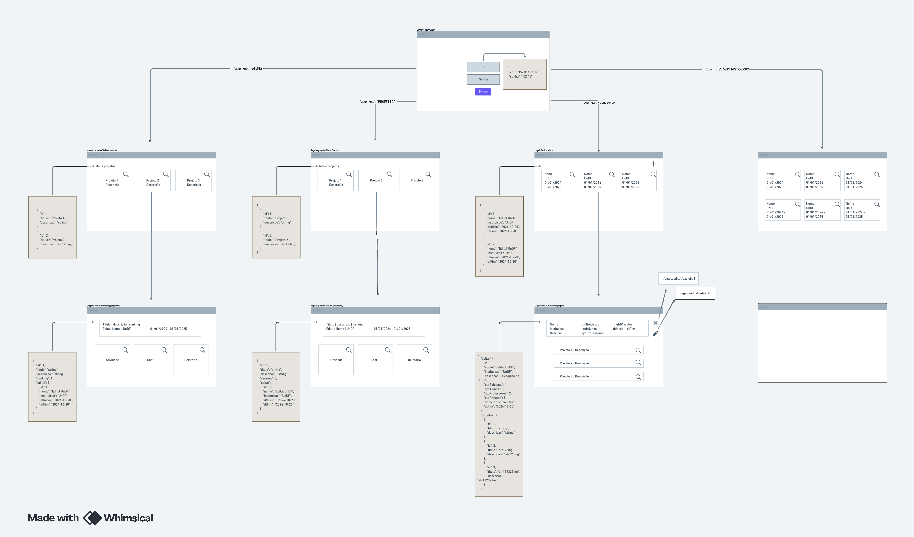

# Back-End

- **Framework**: Spring Boot 3.3.4
- **Versão**: Maven 4.0.0
- **Linguagem**: Java 21
- **Biblioteca** : Lombok 
- **Banco de Dados**: PostgreSQL 16.4
- **Ferramenta de Visualização**: DBeaver

## IDE Recomendada

- **IDE**: STS - Spring Tools Suite
- **Configuração do Lombok**:
    - Faça o download do arquivo Lombok: [Aqui](https://projectlombok.org/download) 
    - Associe o Lombok ao STS.

?> Dica: Certifique-se de que sua versão do STS suporta Java 21.

!> Alerta: Configurar adequadamente o Lombok é essencial para evitar erros na compilação.

## Dependências do Projeto

O projeto utiliza as seguintes dependências:

```xml
<dependencies>
    <dependency>
        <groupId>org.springframework.boot</groupId>
        <artifactId>spring-boot-starter-data-jpa</artifactId>
    </dependency>
    <dependency>
        <groupId>org.springframework.boot</groupId>
        <artifactId>spring-boot-starter-security</artifactId>
    </dependency>
    <dependency>
        <groupId>org.springframework.boot</groupId>
        <artifactId>spring-boot-starter-web</artifactId>
    </dependency>
    <dependency>
        <groupId>org.postgresql</groupId>
        <artifactId>postgresql</artifactId>
        <scope>runtime</scope>
    </dependency>
    <dependency>
        <groupId>org.projectlombok</groupId>
        <artifactId>lombok</artifactId>
        <optional>true</optional>
    </dependency>
    <dependency>
        <groupId>org.springframework.boot</groupId>
        <artifactId>spring-boot-starter-test</artifactId>
        <scope>test</scope>
    </dependency>
    <dependency>
        <groupId>org.springframework.security</groupId>
        <artifactId>spring-security-test</artifactId>
        <scope>test</scope>
    </dependency>
</dependencies>
```

## Pré-requisitos

Certifique-se de ter as seguintes ferramentas instaladas:
   
 - **STS(Spring Tool Suite)**

 - **PostgreSQL com uma base de dados configurada.**

 - **Lombok, integrado ao STS.**

Além disso, tenha:

- O código-fonte do projeto localmente.
- O arquivo `application.yml` ou `application.properties` configurado para conexão com o PostgreSQL.

## Guia de Configuração do Projeto

1. **STS (Spring Tool Suite)**  
   - **Download e Instalação:**  
     - Acesse o site oficial do [Spring Tool Suite](https://spring.io/tools).  
     - Faça o download da versão compatível com o seu sistema operacional.  
     - Instale a IDE no seu computador.  
   - **Teste:**  
     - Abra o STS e verifique se a interface inicializa corretamente.

2. **PostgreSQL com uma base de dados configurada**  
   - **Código para Criar a Base de Dados no PostgreSQL:**  
     Acesse o PostgreSQL (via terminal, pgAdmin ou DBeaver) e execute:  
     ```sql
     CREATE DATABASE nome_da_sua_base;
     CREATE USER seu_usuario WITH PASSWORD 'sua_senha';
     GRANT ALL PRIVILEGES ON DATABASE nome_da_sua_base TO seu_usuario;
     ```
   - Teste a conexão usando o cliente DBeaver, pgAdmin ou outro método de acesso ao banco.

3. **Lombok integrado ao STS**  
   - **Passos para Configurar:**  
     - Baixe o Lombok: [Download](https://projectlombok.org/download).  
     - Localize o arquivo `lombok.jar` baixado.  
     - Execute-o com o comando (no terminal ou diretamente no explorador de arquivos):  
       ```bash
       java -jar lombok.jar
       ```
     - Associe o Lombok ao STS na interface de instalação que será aberta.

4. **O código-fonte do projeto localmente**  
   - Certifique-se de clonar o repositório do projeto ou copiar os arquivos para o seu computador.  
     ```bash
     git clone https://github.com/seu-repositorio/projeto.git
     ```
   - Abra o projeto no STS como descrito no guia.

5. **Arquivo `application.yml` ou `application.properties` configurado**  
   - Exemplo de configuração (`application.yml`):  
     ```yaml
     spring:
       datasource:
         url: jdbc:postgresql://localhost:5432/nome_da_sua_base
         username: seu_usuario
         password: sua_senha
       jpa:
         hibernate:
           ddl-auto: update
         show-sql: true
     ```

## Endpoints


