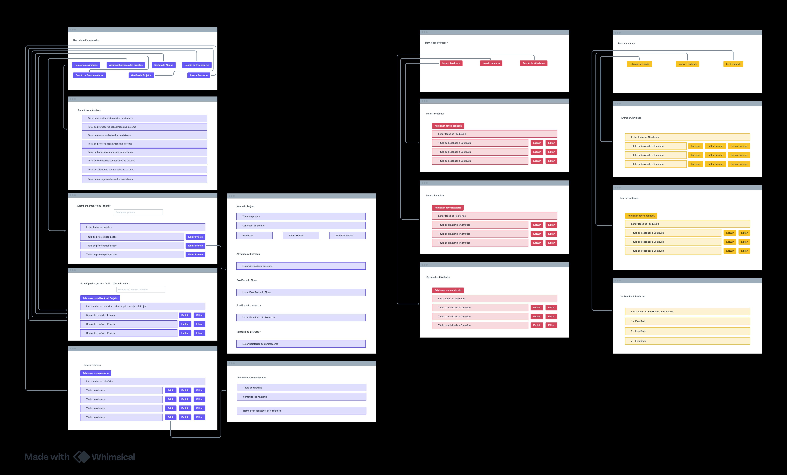

# Requisitos do Sistema

O **Sistema de Gestão de Iniciação Científica** foi desenvolvido para gerenciar e acompanhar projetos de iniciação científica, abrangendo funcionalidades essenciais para cadastro, organização e monitoramento de usuários, projetos e atividades.

# Gestão de Usuários
- **Cadastro de Usuários:**  
  - Inclusão de alunos, professores (orientadores) e coordenadores.  
- **Autenticação e Controle de Acesso:**  
  - Acesso gerenciado exclusivamente pela **coordenação**.  

# Gestão de Projetos de Iniciação Científica
- **Funcionalidades:**  
  - Criação, edição, exclusão e gerenciamento de projetos.  
  - Registro e vinculação de alunos, professores (orientadores) e coordenadores aos projetos.  

# Acompanhamento de Atividades
- **Registro de Atividades:**  
  - Documentação das atividades realizadas pelos alunos.  
- **Aprovação e Feedback:**  
  - Professores responsáveis devem aprovar e fornecer feedback sobre as atividades.  
- **Monitoramento:**  
  - Verificação do cumprimento de metas e prazos estabelecidos nos projetos.  

# Avaliação e Feedback
- **Avaliação de Desempenho:**  
  - Professores avaliam o desempenho dos alunos em seus projetos.  
  - Alunos avaliam o desempenho dos professores enquanto orientadores.  
- **Feedback Individualizado:**  
  - Comentários detalhados sobre o progresso e a qualidade do trabalho realizado.  

# Documentação e Relatórios
- **Upload e Compartilhamento:**  
  - Envio e compartilhamento de documentos científicos entre os envolvidos.  
- **Geração de Relatórios:**  
  - Relatórios periódicos sobre o progresso dos projetos.  
